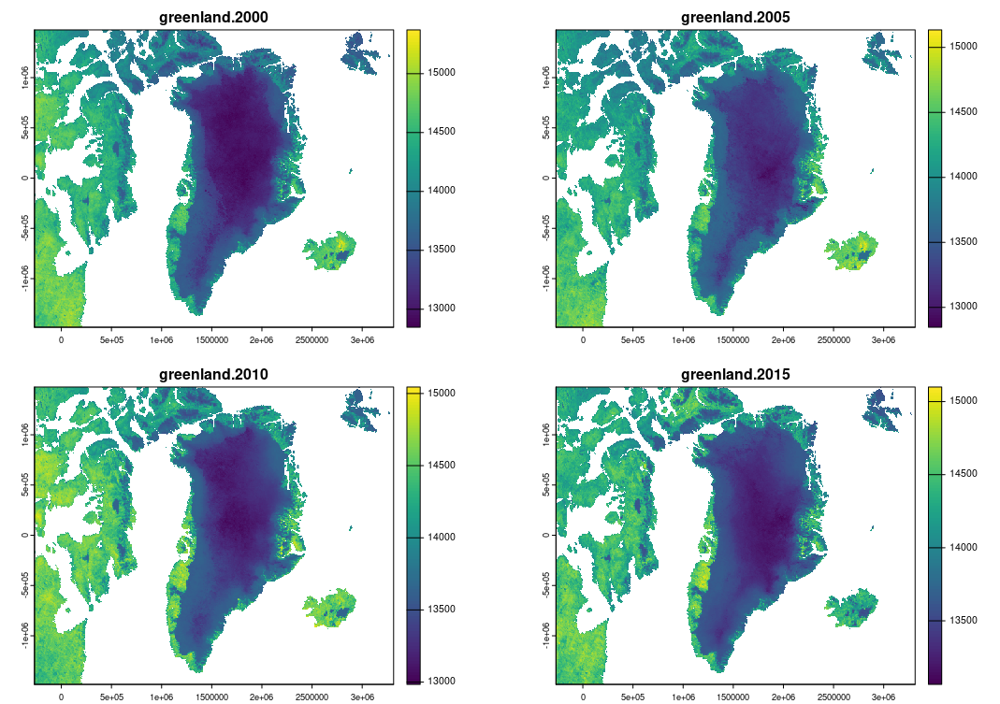
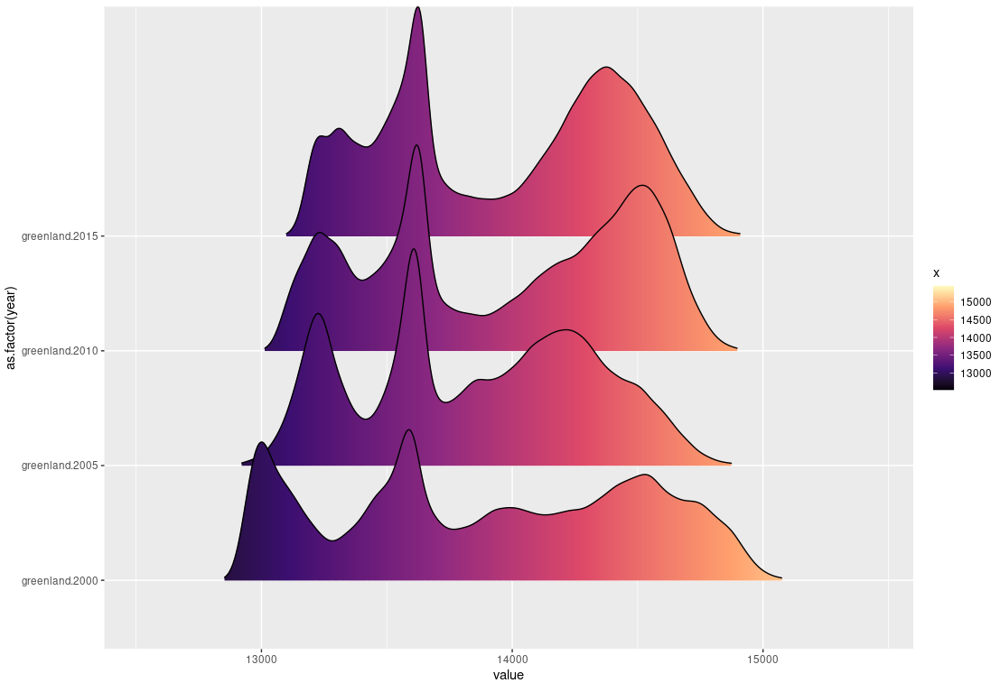

## Importing the data from the imageRy package

``` r
library(sf)
library(terra)
library(tidyverse)
library(ggplot2)
library(imageRy)
library(ggridges)

r <- im.import("greenland")
plot(r)
```

The input data look like:
<p align="center">

</p>

## Converting to dataframe and matrix

``` r
df <- as.data.frame(r) 

dfpl <- df %>%
  flatten_dbl() %>%
  as.data.frame() %>%
  mutate(year = rep(names(r), each = nrow(df)))

colnames(dfpl)[1] <- "value"
```

## Final plot

``` r
ggplot(dfpl, aes(x = value, y = as.factor(year), fill = stat(x))) +
  geom_density_ridges_gradient(scale = 2, rel_min_height = 0.01) +
  scale_fill_viridis_c(option = "magma") 
```

The final plot looks like:
<p align="center">

</p>
